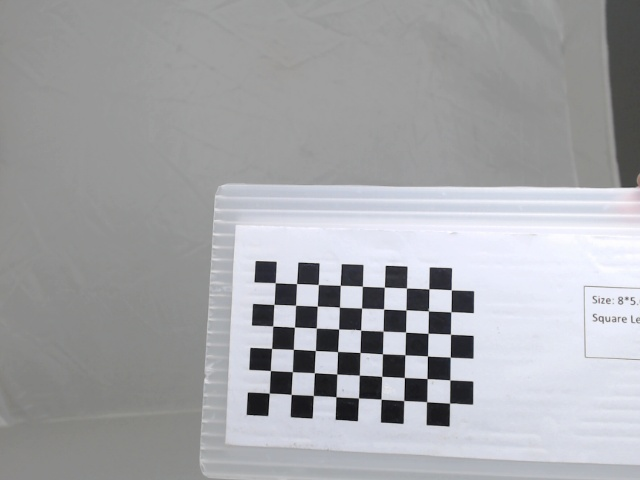
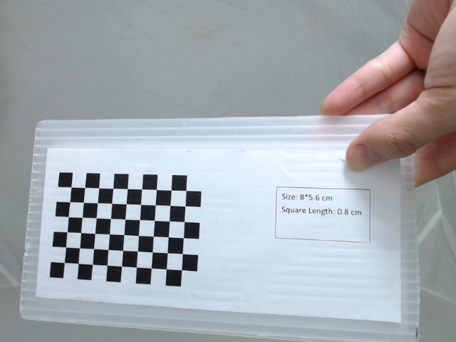
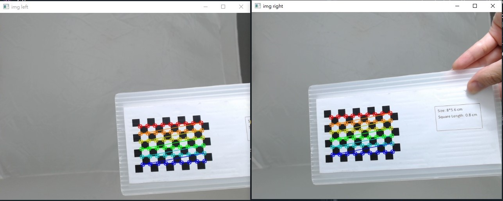
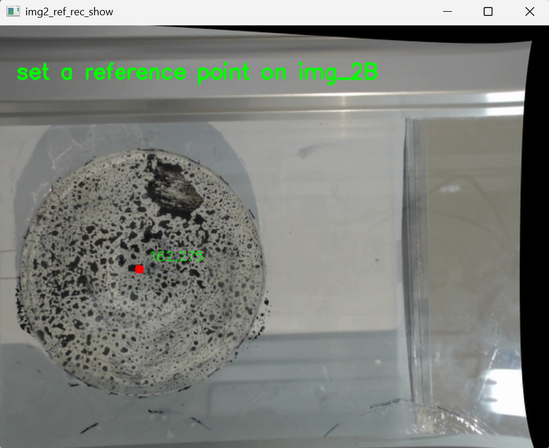
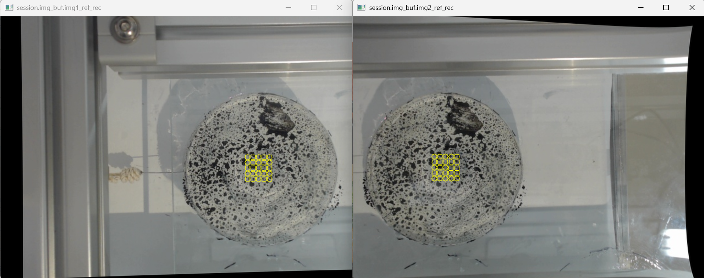
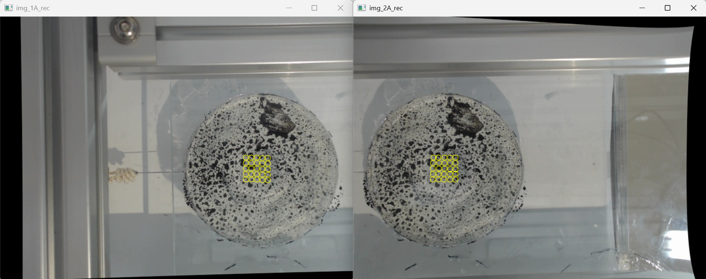

# 3D DIC deformation measurement system 
A stereo vision-based **3D displacement measurement system** using  
**Digital Image Correlation (DIC)** for high-precision surface deformation analysis. 

## Overview
This project implements a optimized **Stereo Digital Image Correlation (Stereo-DIC)** method  
to reconstruct and measure **3D surface displacement** using two webcams.

It is designed for:
- High-precision deformation measurement
- Fast computation pipeline
- Low-cost stereo vision setup

## Features
* High-Precision 3D Displacement Measurement
* High Efficiency
* Low-Cost Camera-Based Setup
* User-Friendly Interface & Configuration

## Example:
Below shows displacement measurement of a **deformed rubber surface with speckle pattern**:
## How to run:
* Environment  
> Windows 11  
> MinGW GCC  
> Python 3.13.3  
* Clone with submodules
```shell
git clone --recurse-submodules <URL>
```

* Create new venv
```shell
python -m venv venv
.\venv\Scripts\Activate.ps1 # Activating
```

If it show error msg while activating, run below command first, and try again:
```shell
Set-ExecutionPolicy -ExecutionPolicy RemoteSigned -Scope Process
```

* Install modules in venv:
```shell
pip install opencv-python
pip install matplotlib
```

### STEP1: capture checkerboard images (skip if use example case)
* Objection:   
correct the two images to parallel to each others, make the result more precise  
* How to:  
capture severals checkerboards images (10 mores), and run stereo camera calibration to obtain the intrinsic and extrinsic params. Use params to rectify images.  

Ternminal:  
```
python -m apps.stereo_capture_cal_images
```
### Left camera:　　

　

### Right camera:　　

　

### STEP2: camera calibration
Run stereo camera calibration to obtain the intrinsic and extrinsic params, and use it to rectify images.

```
python -m apps.stereo_calibration
```

　

### STEP3: measure the displacement of the surface on rubber
Run the following command from the project root directory (3D-DIC_measurement_system/):  
* Build:
```shell
mingw32-make all
```
* Run 3D measurement
```shell
python -m apps.compute_disp_field
```
I. First, user need to select the points of interest (tracking points) that they want to track:



II. The system then searches for the corresponding points in the stereo image pair and estimates the initial 3D coordinates of all selected tracking points:


III. Finally, the system compares the reference and target images to calculate the average surface displacement of the rubber specimen:  


## Example Result
> Average time per point:  0.002 (s)  
> Average in-plain displacement: 1.097 (mm)
